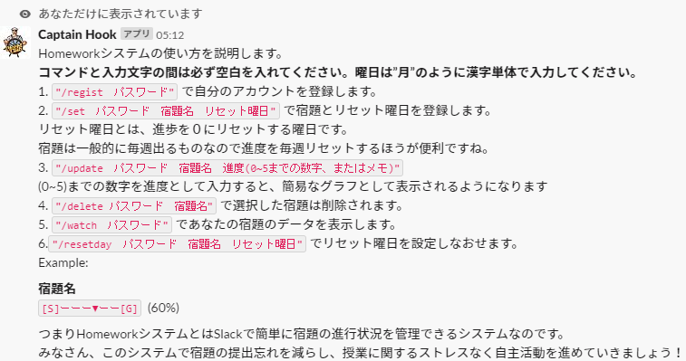
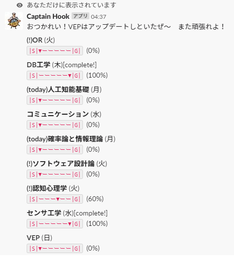

## CaptainHomework
SlackのSlashCommandを利用してSlackから自分の宿題を管理するアプリです。

よく使うSlackで宿題の進度を管理できたら便利だと思い作りました。

宿題は毎週でますよね。宿題を提出するたびに宿題の進度を自動で毎回０に設定してくれると便利です！
なのでリセット曜日をもうけて、その曜日が来ると進度を０に設定するという機能をつけました。（正確には当日の18時ごろ←授業が終了する時間帯）

SlackのSlachCommandで個人ごとにデータを振り分けるためパスワードを設定してもらいます。

- #### 説明

- #### 使用例

(!)は明日の宿題を示す

